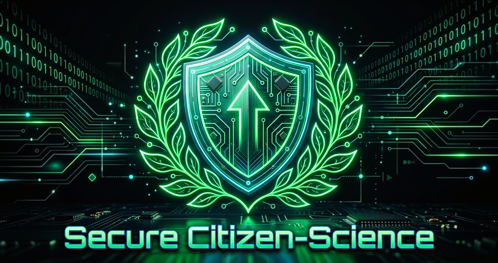

# 🛡️ Secure Citizen-Science Privacy Wrapper

[](https://python.org)
[](https://streamlit.io)
[](https://pydantic.dev)
[](https://github.com/google/adk)
[](https://modelcontextprotocol.io)

An advanced, privacy-first multi-agent reporting platform built on the **Google Agent Development Kit (ADK)** and a custom **Model Context Protocol (MCP)** server. Designed to empower citizens to report environmental hazards anonymously, this platform removes all Personally Identifiable Information (PII) before storage, structures unstructured reports, and runs automated community trend analytics.



---

## 🌟 Key Features

*   **🕵️ Soft LLM-based Redaction**: A specialized `PrivacyGuardAgent` automatically strips names, phone numbers, and email addresses, and generalizes exact building/street addresses to general neighborhood tags.
*   **🔒 Hard Deterministic Verification**: A pythonic `privacy_verification_skill` runs strict regular expression checks on the sanitized text as a secondary defense-in-depth safety guardrail, immediately aborting execution upon any leaked PII.
*   **📊 Structured Extraction**: An `IncidentAnalysisAgent` translates unstructured natural language reports into structured environmental intelligence (Category, Severity, Generalized Location, Summary).
*   **✨ Strict Pydantic Validation**: All structured outputs are schema-validated using Pydantic v2 to enforce typing and categorical constraints (e.g. limiting severity strictly to *Low*, *Medium*, *High*, or *Critical*).
*   **💾 Database Isolation via MCP**: A custom Python MCP Server isolates direct SQLite writes behind a secure `secure_log_incident` tool over stdio transport.
*   **📈 Cached Trend Analytics**: An autonomous `TrendAnalysisAgent` processes SQLite logs, extracting hotspots and advisories cached locally in `community_trends.json` to prevent slow/costly API calls on page refreshes.
*   **🔑 Role-Based Access Control**:
    *   *Citizen View*: A simple, clean form allowing report submissions and displaying public community hazard trend charts.
    *   *Administrator View*: Passcode-protected console (`admin123`) exposing API configuration parameters, preset scenarios, raw database tables, data clearing utilities, and passcode management.

---

## 📐 System Architecture & Data Flow

Unlike the system layout, the execution flow is completely sequential to guarantee validation checks are run in order:

```mermaid
sequenceDiagram
    autonumber
    actor Citizen as Citizen
    participant UI as Streamlit UI
    participant Root as ADK Root Agent
    participant PG as Privacy Guard Agent (LLM)
    participant PV as Privacy Verification (Regex)
    participant IA as Incident Analysis Agent (LLM)
    participant Val as Pydantic Validation Layer
    participant MCP as Custom MCP Server
    database DB as SQLite Database

    Citizen->>UI: Submit Raw Report
    UI->>Root: Run Sequential Pipeline
    Root->>PG: Preprocess & Redact PII
    PG-->>Root: Return Sanitized Text
    Root->>PV: Scan for PII leaks
    Note over PV: If phone/email format is found,<br/>abort immediately!
    PV-->>Root: Verification Passed
    Root->>IA: Structure Hazard Details
    IA-->>Root: Return JSON Metadata
    Root->>Val: Validate Schema & Anonymize User Hash
    Val-->>Root: Return Validated Object
    Root->>MCP: Call secure_log_incident Tool
    MCP->>DB: Write Sanitized Record to SQLite
    DB-->>MCP: Confirm Write
    MCP-->>Root: Return Confirmation (INC-100X)
    Root-->>UI: Display Anonymized Success Panel
```

---

## 🚀 Setup & Execution

### Prerequisites
*   Python 3.11+
*   `uv` package manager (optional, but highly recommended)

### 1. Installation
Clone the repository and install the dependencies:
```bash
# If using uv
uv pip install -r requirements.txt

# Or if using standard pip
pip install -r requirements.txt
```

### 2. Configure Environment Variables (Optional)
Create a `.env` file in the root of the project to pre-load your API key:
```env
GEMINI_API_KEY=your_gemini_api_key_here
```
*(Alternatively, you can type your Gemini API key directly into the sidebar of the Streamlit application at runtime).*

### 3. Run the Streamlit Application
Start the Streamlit local development server:
```bash
streamlit run app.py
```

### 4. Run Automated Tests
To execute deterministic tests verifying agent nodes, regex verification, Pydantic validation, and MCP SQLite database writes:
```bash
python verify_project.py
```
*(Note: Tests run against an isolated `test_reports.db` which is cleaned up automatically, leaving your production logs untouched).*

---

## ☁️ Deployment on Streamlit Community Cloud

To deploy this application to **Streamlit Community Cloud** (share.streamlit.io):

1.  **Push to GitHub**:
    Initialize a Git repository, commit your files, and push them to GitHub. Make sure your `.gitignore` excludes `.venv`, `__pycache__`, and the database files (`*.db`, `test_reports.db`).
2.  **Deploy on share.streamlit.io**:
    *   Sign in to [Streamlit Share](https://share.streamlit.io) using your GitHub account.
    *   Click **New app**.
    *   Select your repository, branch (`main`), and main file path (`app.py`).
3.  **Configure Secrets**:
    *   In the app settings page, navigate to **Secrets**.
    *   Add your Gemini API Key so the app can access it automatically without user input:
        ```toml
        GEMINI_API_KEY = "your-gemini-api-key-value-here"
        ```
    *   Click **Save**. The application will redeploy automatically.
